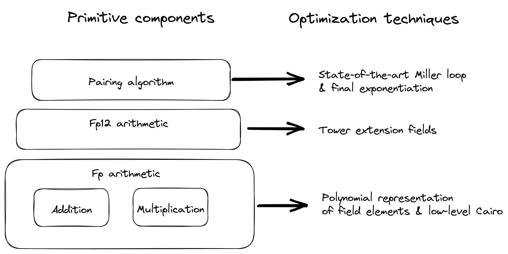

<div align="center">
  <h1>Garaga</h1>
  
  <br />
  <a href="https://github.com/keep-starknet-strange/garaga/issues/new?assignees=&labels=bug&template=01_BUG_REPORT.md&title=bug%3A+">Report a Bug</a>
  -
  <a href="https://github.com/keep-starknet-strange/garaga/issues/new?assignees=&labels=enhancement&template=02_FEATURE_REQUEST.md&title=feat%3A+">Request a Feature</a>
  -
  <a href="https://github.com/keep-starknet-strange/garaga/discussions">Ask a Question</a>
</div>

<div align="center">
<br />

[](https://github.com/keep-starknet-strange/garaga/actions/workflows/test.yml)
[](LICENSE)
[](https://github.com/keep-starknet-strange/garaga/issues?q=is%3Aissue+is%3Aopen+label%3A%22help+wanted%22)

</div>

<details open="open">
<summary>Table of Contents</summary>

- [About](#about)
- [Architecture overview](#architecture-overview)
- [Prerequisites](#prerequisites)
- [Usage](#usage)
- [Benchmarks](#benchmarks)
- [Get Support](#support)
- [Contribute](#contributing)
- [Security](#security)
- [License](#license)
- [Acknowledgements](#acknowledgements)
- [Resources (documents)](#resources)
- [Contributors](#contributors)

</details>

## About

> Efficient pairing library using polynomial representation of field elements, written in Cairo 🐺.

Garaga can enable efficient pairing operations in StarkNet, by using polynomial representation of field elements. This is a work in progress, and is not yet ready for production use.

Here are some interesting use cases enabled by Garaga:
- SNARKs on StarkNet: would enable privacy-preserving computations on StarkNet.
- KZG cryptographic commitment scheme.
- Identity-based encryption schemes.
- Attribute-based encryption schemes.
- BLS (Boneh–Lynn–Shacham) Digital Signature scheme. 

We are exploring many optimizations techniques. For example, we are currently working on a new technique to reduce the number of constraints in the pairing computation. This technique is based on the idea of using a polynomial representation of field elements.
## Architecture overview

[](docs/images/garaga-architecture-overview.png)


## Prerequisites

#### Cairo
- [cairo-lang](https://github.com/starkware-libs/cairo-lang)
- [Python 3.9](https://www.python.org/downloads/)
- [protostar](https://docs.swmansion.com/protostar/docs/cairo-1/installation)
  
Specifically for profiling and testing, the following tools dependencies are required:
- [Go](https://golang.org/doc/install)
- [pprof](https://github.com/google/pprof)
- [graphviz](https://graphviz.org/download/) 

## Usage


### One time step: prepare virtual environment, dependencies and tools:

```bash
make setup
```

#### Compile all .cairo files (optional)

```bash
make build
```
#### re-compile Go parsing tool for tests (optional)

```bash 
make go 
```
### Run .cairo programs (interactive script!) 

```bash
make run
```

### Run and profile .cairo programs (interactive script!) 

```bash
make run-profile
```

### Run all or specific protostar tests
```bash
protostar test-cairo0 --max-steps 10000000 -x
protostar test-cairo0 --max-steps 10000000 tests/protostar_tests/bn254/test_e2.cairo
protostar test-cairo0 --max-steps 10000000 tests/protostar_tests/bn254/test_pair.cairo::test_final_exp
protostar test-cairo0 --max-steps 10000000 tests/protostar_tests/bls12_381/test_e12.cairo

```

## Benchmarks
| Operation on curve BN254 | Cairo steps or estimation |
|---------|---------------|
| miller_loop | 320 848 |
| multi_miller_loop (N points) | ~ N * 260441 + 60407  |
| final_exponentiation | 270 215 |
| Groth16 circuit example (4 public inputs) | 1 671 116|

| Operation on curve BLS12-381| Cairo steps (number) (OBSOLETE: Wait for optimisation, expect /8) |
|---------|---------------|
| miller_loop | 2 177 205 |
| miller_loop with pre-computed G2 values | 1 974 939 |
| final_exponentiation | 3 666 209 |
| e(P:G1, Q:G2) | 5 843 414|
| e(P:G1, Q:G2) with pre-computed G2 values | 5 641 148|

Work is in progress to convert fq_bigint library to built-ins, which should reduce the above costs by more than 70%. 

## Support

Reach out to the maintainer at one of the following places:

- [GitHub Discussions](https://github.com/keep-starknet-strange/garaga/discussions)

- [Garaga on telegram](https://t.me/GaragaPairingCairo)

## Contributing

See the [open issues](https://github.com/keep-starknet-strange/garaga/issues) for
a list of proposed features (and known issues).  
Please read [our contribution guidelines](docs/CONTRIBUTING.md), and thank you
for being involved!

If you want to say **thank you** or/and support active development of Garaga:

- Add a [GitHub Star](https://github.com/keep-starknet-strange/garaga) to the
  project.
- Tweet about Garaga.
- Write interesting articles about the project on [Dev.to](https://dev.to/),
  [Medium](https://medium.com/) or your personal blog.

Thank you for taking the time to contribute! Contributions are what make
the open-source community such an amazing place to learn, inspire, and create.
Any contributions you make will benefit everybody else and are **greatly
appreciated**.


## Security

Garaga follows good practices of security, but 100% security cannot be assured.
Garaga is provided **"as is"** without any **warranty**. Use at your own risk.

_For more information and to report security issues, please refer to our
[security documentation](docs/SECURITY.md)._

## License

This project is licensed under the **MIT license**.

See [LICENSE](LICENSE) for more information.

## Acknowledgements

- Huge props to [tekkac](https://github.com/tekkac) and [feltroidprime](https://github.com/feltroidprime) for their initial work on provable pairing-based cryptography in StarkNet.
- Credits to [Nethermind](https://github.com/NethermindEth/) for their [initial work on optimized modular arithmetic](https://github.com/NethermindEth/research-basic-Cairo-operations-big-integers/tree/main/lib).
- [Herodotus](https://www.herodotus.dev/) for supporting this project.
- [Gnark project](https://github.com/ConsenSys/gnark-crypto) and team, especially [yelhousni](https://github.com/yelhousni) for his amazing knowledge and support.
- [OnlyDust](https://www.onlydust.xyz/) and [Starkware](https://starkware.co/). 
## Resources

Here are some interesting resources about pairing-based cryptography:

> **Note:** This list is not exhaustive, and is not intended to be.

- Document A :: [Pairing for beginners](https://static1.squarespace.com/static/5fdbb09f31d71c1227082339/t/5ff394720493bd28278889c6/1609798774687/PairingsForBeginners.pdf) : A beginner-friendly overall introduction of the concept and techniques, including Towered extension fields in section 7.3. (2012)  
- Document B :: [Efficient Hardware Implementation of IFp-Arithmetic for Pairing-Friendly Curves](https://ieeexplore.ieee.org/abstract/document/5740859) : Fast Fp modular multiplication using polynomial representation of field elements. Currently being implemented. (2012)  
- Document C :: [High-Speed Software Implementation of the Optimal Ate Pairing over Barreto–Naehrig Curves](https://eprint.iacr.org/2010/354.pdf) Useful, relatively effective ready-to-use formulas including for Fp, Fp12 arithmetics. Should be composable with Document B.  
- Document D :: [Efficient Multiplication over Extension Fields](https://www.emse.fr/~nadia.el-mrabet/Article/WAIFI2012.pdf) Generalized Arithmetic on any extension field using polynomial representation of field elements. This work could enable polynomial representation of elements of finite field of any prime order, and thus very efficient pairing for any BN curve, including alt_bn128. 
- Document E :: [Accelerated tower arithmetic](https://hal.archives-ouvertes.fr/hal-01788403/file/tower.pdf)  Close to state-of-the art solution for Fp12 arithmetics. Similar to Document D but harder. (2019)  

## Contributors
For a full list of all authors and contributors, see
[the contributors page](https://github.com/keep-starknet-strange/garaga/contributors).

Thanks goes to these wonderful people ([emoji key](https://allcontributors.org/docs/en/emoji-key)):

<!-- ALL-CONTRIBUTORS-LIST:START - Do not remove or modify this section -->
<!-- prettier-ignore-start -->
<!-- markdownlint-disable -->
<table>
  <tbody>
    <tr>
      <td align="center" valign="top" width="14.28%"><a href="https://github.com/feltroidprime"><br /><sub><b>Feltroid Prime</b></sub></a><br /><a href="https://github.com/keep-starknet-strange/garaga/commits?author=feltroidprime" title="Code">💻</a></td>
      <td align="center" valign="top" width="14.28%"><a href="https://github.com/abdelhamidbakhta"><br /><sub><b>Abdel @ StarkWare </b></sub></a><br /><a href="https://github.com/keep-starknet-strange/garaga/commits?author=abdelhamidbakhta" title="Code">💻</a></td>
      <td align="center" valign="top" width="14.28%"><a href="https://github.com/tekkac"><br /><sub><b>Tarik K.</b></sub></a><br /><a href="https://github.com/keep-starknet-strange/garaga/commits?author=tekkac" title="Code">💻</a></td>
    </tr>
  </tbody>
  <tfoot>
    <tr>
      <td align="center" size="13px" colspan="7">
        
          <a href="https://all-contributors.js.org/docs/en/bot/usage">Add your contributions</a>
        </img>
      </td>
    </tr>
  </tfoot>
</table>

<!-- markdownlint-restore -->
<!-- prettier-ignore-end -->

<!-- ALL-CONTRIBUTORS-LIST:END -->

This project follows the [all-contributors](https://github.com/all-contributors/all-contributors) specification. Contributions of any kind welcome!
