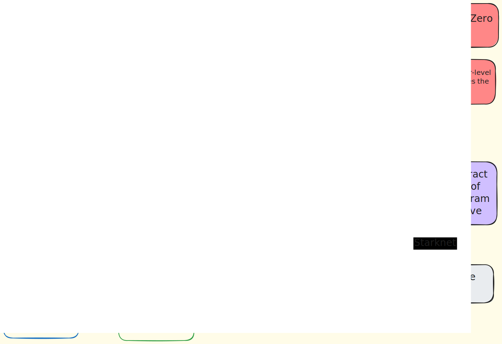

<div align="center">
  <h1>Garaga</h1>
  
  <br />
  <a href="https://github.com/keep-starknet-strange/garaga/issues/new?assignees=&labels=bug&template=01_BUG_REPORT.md&title=bug%3A+">Report a Bug</a>
  -
  <a href="https://github.com/keep-starknet-strange/garaga/issues/new?assignees=&labels=enhancement&template=02_FEATURE_REQUEST.md&title=feat%3A+">Request a Feature</a>
  -
  <a href="https://github.com/keep-starknet-strange/garaga/discussions">Ask a Question</a>
</div>

<div align="center">
<br />

[](https://github.com/keep-starknet-strange/garaga/actions)
[](LICENSE)
[](https://github.com/keep-starknet-strange/garaga/issues?q=is%3Aissue+is%3Aopen+label%3A%22help+wanted%22)

[![Exploration_Team](https://img.shields.io/badge/Exploration_Team-29296E.svg?&style=for-the-badge&logo=data:image/svg%2bxml;base64,PD94bWwgdmVyc2lvbj0iMS4wIiBlbmNvZGluZz0iVVRGLTgiPz48c3ZnIGlkPSJhIiB4bWxucz0iaHR0cDovL3d3dy53My5vcmcvMjAwMC9zdmciIHZpZXdCb3g9IjAgMCAxODEgMTgxIj48ZGVmcz48c3R5bGU+LmJ7ZmlsbDojZmZmO308L3N0eWxlPjwvZGVmcz48cGF0aCBjbGFzcz0iYiIgZD0iTTE3Ni43Niw4OC4xOGwtMzYtMzcuNDNjLTEuMzMtMS40OC0zLjQxLTIuMDQtNS4zMS0xLjQybC0xMC42MiwyLjk4LTEyLjk1LDMuNjNoLjc4YzUuMTQtNC41Nyw5LjktOS41NSwxNC4yNS0xNC44OSwxLjY4LTEuNjgsMS44MS0yLjcyLDAtNC4yN0w5Mi40NSwuNzZxLTEuOTQtMS4wNC00LjAxLC4xM2MtMTIuMDQsMTIuNDMtMjMuODMsMjQuNzQtMzYsMzcuNjktMS4yLDEuNDUtMS41LDMuNDQtLjc4LDUuMThsNC4yNywxNi41OGMwLDIuNzIsMS40Miw1LjU3LDIuMDcsOC4yOS00LjczLTUuNjEtOS43NC0xMC45Ny0xNS4wMi0xNi4wNi0xLjY4LTEuODEtMi41OS0xLjgxLTQuNCwwTDQuMzksODguMDVjLTEuNjgsMi4zMy0xLjgxLDIuMzMsMCw0LjUzbDM1Ljg3LDM3LjNjMS4zNiwxLjUzLDMuNSwyLjEsNS40NCwxLjQybDExLjQtMy4xMSwxMi45NS0zLjYzdi45MWMtNS4yOSw0LjE3LTEwLjIyLDguNzYtMTQuNzYsMTMuNzNxLTMuNjMsMi45OC0uNzgsNS4zMWwzMy40MSwzNC44NGMyLjIsMi4yLDIuOTgsMi4yLDUuMTgsMGwzNS40OC0zNy4xN2MxLjU5LTEuMzgsMi4xNi0zLjYsMS40Mi01LjU3LTEuNjgtNi4wOS0zLjI0LTEyLjMtNC43OS0xOC4zOS0uNzQtMi4yNy0xLjIyLTQuNjItMS40Mi02Ljk5LDQuMyw1LjkzLDkuMDcsMTEuNTIsMTQuMjUsMTYuNzEsMS42OCwxLjY4LDIuNzIsMS42OCw0LjQsMGwzNC4zMi0zNS43NHExLjU1LTEuODEsMC00LjAxWm0tNzIuMjYsMTUuMTVjLTMuMTEtLjc4LTYuMDktMS41NS05LjE5LTIuNTktMS43OC0uMzQtMy42MSwuMy00Ljc5LDEuNjhsLTEyLjk1LDEzLjg2Yy0uNzYsLjg1LTEuNDUsMS43Ni0yLjA3LDIuNzJoLS42NWMxLjMtNS4zMSwyLjcyLTEwLjYyLDQuMDEtMTUuOGwxLjY4LTYuNzNjLjg0LTIuMTgsLjE1LTQuNjUtMS42OC02LjA5bC0xMi45NS0xNC4xMmMtLjY0LS40NS0xLjE0LTEuMDgtMS40Mi0xLjgxbDE5LjA0LDUuMTgsMi41OSwuNzhjMi4wNCwuNzYsNC4zMywuMTQsNS43LTEuNTVsMTIuOTUtMTQuMzhzLjc4LTEuMDQsMS42OC0xLjE3Yy0xLjgxLDYuNi0yLjk4LDE0LjEyLTUuNDQsMjAuNDYtMS4wOCwyLjk2LS4wOCw2LjI4LDIuNDYsOC4xNiw0LjI3LDQuMTQsOC4yOSw4LjU1LDEyLjk1LDEyLjk1LDAsMCwxLjMsLjkxLDEuNDIsMi4wN2wtMTMuMzQtMy42M1oiLz48L3N2Zz4=)](https://github.com/keep-starknet-strange)
</div>


</details>

## About

> State-of-the-art Elliptic Curve tooling and SNARKS verification for Cairo & Starknet 🐺.

Garaga enables efficient elliptic curve operations on Starknet.
It achieves state of the art performance by
-  using a dedicated builtin made by Starkware for emulated modular arithmetic
- using a suite of non-deterministic techniques for extension field multiplication, pairings, and multi scalar multiplication to reduce the number of steps to verify results.

Garaga currently supports:
- Scalar & Multi-scalar multiplication for any Weirstrass curve, including BN254, BLS12_381, SECP256/R1, and ED25519. You can add the one you need by specifying the curve parameters.
- Pairing operations for BN254 and BLS12_381.
- Groth16 smart contract verifiers generators for BN254 and BLS12_381.
- Noir smart contract verifiers generators for ultra keccak honk flavour.


## Architecture overview


Garaga consists of a Pythonic backend with Rust bindings and CairoZero / Cairo libraries.
- The Pythonic backend is here to define emulated modular arithmetic circuits that can be compiled to Cairo or Cairo1 code.
    It also handles witnesses generation for the non-deterministic computations, smart contract contract generation for a given proof system and elliptic curve, and calldata generation from a given proof.
- The CairoZero / Starknet interfaces are responsible for composing and calling the circuits, as well as adding all the extra logic needed to make the algorithms work (Fiat-Shamir heuristic, SNARKS verifiers algorithms, etc).

## Quickstart : deploying a SNARK verifier on Starknet

Currently, only Groth16 on BN254 and BLS12_381 is supported with automatic support for json files coming from SnarkJS and Gnark.

1. Create a new directory for you project, and bring the jsons files for verification key, proof file and public inputs inside it.
2. Install the garaga pip package with `pip install garaga`. Python3.10 is mandatory and a virtual environment is recommended. Enter `garaga` in your terminal to get started.
3. Run the `garaga gen` command in your terminal to generate the code for the SNARK verifier given your verification key.
4. Edit the generated smart contract to fit the needs of your dapp.

5. Create an environment file `.secrets` following  the `.secrets.template` file in the root of this repository, containing the Starkner RPC url, your account address, and the private key.
6. Run the `garaga declare` command in your terminal to declare the smart contract on Starknet and obtain its class hash. Note that this is an expensive operation.
7. Run the `garaga deploy` command in your terminal using the class hash obtained in the previous step to get the contract address.

8. Run the `garaga verify-onchain` command in your terminal using the contract address, the verification key, the proof and the public inputs to verify the proof against the SNARK verifier contract.

For more details, please refer to the [documentation](https://garaga.gitbook.io/garaga/).

## Developer setup

To get started with Garaga, you'll need to have some tools and dependencies installed. Here's everything you need:

### Prerequisites

Ensure you have the following installed:
- [Python 3.10](https://www.python.org/downloads/) - /!\ Make sure `python3.10` is a valid command in your terminal. The core language used for development. Make sure you have the correct dependencies installed (in particular, GMP) for the `fastecdsa` python package. See [here](https://pypi.org/project/fastecdsa/#installing) for linux and [here](https://github.com/AntonKueltz/fastecdsa/issues/74) for macos.
- [Scarb 2.11.4](https://docs.swmansion.com/scarb/download.html) - The Cairo package manager. Comes with Cairo inside. Requires [Rust](https://www.rust-lang.org/tools/install).

##### Optionally :

- [pprof](https://github.com/google/pprof) - A tool for visualization and analysis of profiling data. Requires [Go](https://go.dev/).
- [graphviz](https://graphviz.org/download/) - Necessary for generating graphical representations of profiling data.


### Setup

Once you have the prerequisites installed, clone the repository, and set up your development environment with the following command. Be sure to run this command from the root of the repository.


```bash
make setup
```

At this point, you should have everything you need to start developing with Garaga. Before proceeding, make sure to activate the virtual environment by running `source venv/bin/activate`.

## Benchmarks


| OP               |   Weight in steps | Comment                                                                                 |
|------------------|-------------------|-----------------------------------------------------------------------------------------|
| MULMOD           |                 8 | Equivalent cost of a*b % p with the modulo builtin in VM steps                          |
| ADDMOD           |                 4 | Equivalent cost of a+b % p with the modulo builtin in VM steps                          |
| ASSERT_EQ        |                 2 | Equivalent cost of a==b % p with the modulo builtin in VM steps                         |
| RLC              |                28 | Cost of writing a field element to the value segment and retrieving random coefficients |
| POSEIDON 4 LIMBS |                17 | Cost of hashing the 4 limbs of 384 bits emulated field element with Poseidon            |


| circuit                                   |   MULMOD |   ADDMOD |   ASSERT_EQ |   POSEIDON |   RLC |   ~steps |
|-------------------------------------------|----------|----------|-------------|------------|-------|----------|
| Derive Point From X                       |        6 |        2 |           0 |          0 |     0 |       56 |
| Fp6 SQUARE_TORUS                          |       12 |       22 |           0 |          7 |     1 |      324 |
| Fp12 SQUARE                               |       25 |       11 |           0 |         13 |     1 |      480 |
| Fp12 MUL                                  |       36 |       22 |           0 |         13 |     1 |      612 |
| Fp6 MUL_TORUS                             |       36 |       34 |           0 |         13 |     2 |      688 |
| MSM 1 points                              |      150 |      128 |           0 |         52 |     0 |     2544 |
| MSM 2 points                              |      194 |      166 |           0 |         64 |     0 |     3240 |
| MSM 3 points                              |      238 |      204 |           0 |         76 |     0 |     3936 |
| MSM 10 points                             |      546 |      470 |           0 |        160 |     0 |     8808 |
| MSM 50 points                             |     2306 |     1990 |           0 |        640 |     0 |    36648 |
| Miller n=1 BLS12_381                      |     2672 |     2686 |         137 |        790 |    63 |    47588 |
| Miller n=1 BN254                          |     3303 |     3228 |         177 |        828 |    66 |    53130 |
| Miller n=2 BLS12_381                      |     4418 |     4525 |         273 |        812 |    63 |    69558 |
| Miller n=2 BN254                          |     5639 |     5576 |         353 |        852 |    66 |    81898 |
| Miller n=3 BLS12_381                      |     6164 |     6364 |         409 |        834 |    63 |    91528 |
| Final Exp BN254                           |     4681 |     7218 |           3 |       1931 |   317 |   102236 |
| Miller n=3 BN254                          |     7975 |     7924 |         529 |        876 |    66 |   110666 |
| Final Exp BLS12_381                       |     5123 |     9056 |           3 |       2333 |   384 |   127627 |
| MultiPairing n=1 BN254                    |     7984 |    10446 |         180 |       2759 |   383 |   155366 |
| MultiPairing n=1 BLS12_381                |     7795 |    11742 |         140 |       3123 |   447 |   175215 |
| MultiPairing n=2 BN254                    |    10320 |    12794 |         356 |       2783 |   383 |   184134 |
| MultiPairing n=2 BLS12_381                |     9541 |    13581 |         276 |       3145 |   447 |   197185 |
| MultiPairing n=3 BN254                    |    12656 |    15142 |         532 |       2807 |   383 |   212902 |
| MultiPairing n=3 BLS12_381                |    11287 |    15420 |         412 |       3167 |   447 |   219155 |
| BLS12FinalExp Fp12 Karabina No EXTF Trick |     7774 |    43002 |           0 |          0 |     0 |   234200 |

## Cairo Benchmarks

📊 **Click on any section below to expand and view detailed benchmark tables with test performance metrics.**

<details open>
<summary><strong>garaga</strong></summary>

<details open>
<summary><strong>└── tests</strong></summary>

<details open>
<summary><strong>│   └── autogenerated</strong></summary>

<details>
<summary><strong>│   │   └── msm_tests</strong></summary>

| Test Name                                                                      | Steps   | Range Check   | Range Check 96   | Add Mod   | Mul Mod   | Sierra Gas   |
|--------------------------------------------------------------------------------|---------|---------------|------------------|-----------|-----------|--------------|
| [test_msm_SECP256R1_3P](docs/benchmarks/test_msm_SECP256R1_3P.png)             | 23,828  | 1,577         | 29,835           | 3,546     | 3,252     | 6,943,738    |
| [test_msm_SECP256K1_3P](docs/benchmarks/test_msm_SECP256K1_3P.png)             | 31,051  | 3,088         | 23,194           | 2,707     | 2,359     | 6,667,570    |
| [test_msm_SECP256R1_2P](docs/benchmarks/test_msm_SECP256R1_2P.png)             | 15,967  | 1,054         | 19,865           | 2,363     | 2,166     | 4,634,674    |
| [test_msm_SECP256K1_2P](docs/benchmarks/test_msm_SECP256K1_2P.png)             | 20,672  | 2,062         | 15,369           | 1,799     | 1,564     | 4,430,630    |
| [test_msm_SECP256R1_1P](docs/benchmarks/test_msm_SECP256R1_1P.png)             | 8,292   | 531           | 9,945            | 1,182     | 1,084     | 2,349,886    |
| [test_msm_SECP256K1_1P](docs/benchmarks/test_msm_SECP256K1_1P.png)             | 10,657  | 1,038         | 7,697            | 900       | 783       | 2,249,324    |
| [test_msm_BN254_1P](docs/benchmarks/test_msm_BN254_1P.png)                     | 10,337  | 1,042         | 7,569            | 892       | 771       | 2,201,348    |
| [test_msm_BN254_1P_edge_case](docs/benchmarks/test_msm_BN254_1P_edge_case.png) | 2,103   | 107           | 155              | 7         | 18        | 238,952      |

</details>

<details>
<summary><strong>│   │   └── ecdsa_tests</strong></summary>

| Test Name                                                        | Steps   | Range Check   | Range Check 96   | Add Mod   | Mul Mod   | Sierra Gas   |
|------------------------------------------------------------------|---------|---------------|------------------|-----------|-----------|--------------|
| [test_ecdsa_SECP256R1](docs/benchmarks/test_ecdsa_SECP256R1.png) | 16,636  | 1,074         | 20,022           | 2,367     | 2,184     | 4,723,558    |
| [test_ecdsa_SECP256K1](docs/benchmarks/test_ecdsa_SECP256K1.png) | 21,528  | 2,084         | 15,629           | 1,810     | 1,592     | 4,551,772    |

</details>

<details>
<summary><strong>│   │   └── eddsa_tests</strong></summary>

| Test Name                                                  | Steps   | Range Check   | Range Check 96   | Bitwise   | Add Mod   | Mul Mod   | Sierra Gas   |
|------------------------------------------------------------|---------|---------------|------------------|-----------|-----------|-----------|--------------|
| [test_eddsa_32_64B](docs/benchmarks/test_eddsa_32_64B.png) | 100,665 | 14,068        | 20,418           | 3,288     | 2,388     | 2,236     | 16,011,356   |
| [test_eddsa_16_32B](docs/benchmarks/test_eddsa_16_32B.png) | 59,707  | 7,748         | 20,496           | 1,656     | 2,394     | 2,244     | 10,532,280   |
| [test_eddsa_0_0B](docs/benchmarks/test_eddsa_0_0B.png)     | 58,623  | 7,686         | 20,521           | 1,656     | 2,395     | 2,246     | 10,422,378   |

</details>

<details>
<summary><strong>│   │   └── pairing_tests</strong></summary>

| Test Name                                                                                                                                    | Steps   |   Range Check | Range Check 96   |   Poseidon | Add Mod   | Mul Mod   | Sierra Gas   |
|----------------------------------------------------------------------------------------------------------------------------------------------|---------|---------------|------------------|------------|-----------|-----------|--------------|
| [test_BN254_mpcheck_3P_2F_with_extra_miller_loop_result](docs/benchmarks/test_BN254_mpcheck_3P_2F_with_extra_miller_loop_result.png)         | 77,808  |           574 | 59,838           |        681 | 4,505     | 8,043     | 17,400,401   |
| [test_BLS12_381_mpcheck_3P_2F_with_extra_miller_loop_result](docs/benchmarks/test_BLS12_381_mpcheck_3P_2F_with_extra_miller_loop_result.png) | 65,991  |           368 | 45,634           |        597 | 3,501     | 5,901     | 13,842,925   |
| [test_BN254_mpcheck_2P_2F](docs/benchmarks/test_BN254_mpcheck_2P_2F.png)                                                                     | 61,766  |           462 | 33,232           |        607 | 1,731     | 4,702     | 11,606,107   |
| [test_BLS12_381_mpcheck_2P_2F](docs/benchmarks/test_BLS12_381_mpcheck_2P_2F.png)                                                             | 53,761  |           309 | 25,204           |        544 | 1,397     | 3,354     | 9,423,384    |

</details>

<details>
<summary><strong>│   │   └── schnorr_tests</strong></summary>

| Test Name                                                            | Steps   | Range Check   | Range Check 96   | Add Mod   | Mul Mod   | Sierra Gas   |
|----------------------------------------------------------------------|---------|---------------|------------------|-----------|-----------|--------------|
| [test_schnorr_SECP256K1](docs/benchmarks/test_schnorr_SECP256K1.png) | 21,082  | 2,083         | 15,512           | 1,808     | 1,580     | 4,492,842    |

</details>

<details>
<summary><strong>│   │   └── tower_pairing_tests</strong></summary>

| Test Name                                                                              | Steps   |   Range Check | Range Check 96   | Add Mod   | Mul Mod   | Sierra Gas   |
|----------------------------------------------------------------------------------------|---------|---------------|------------------|-----------|-----------|--------------|
| [test_tower_pairing_BN254_3P](docs/benchmarks/test_tower_pairing_BN254_3P.png)         | 299,939 |           622 | 626,255          | 94,555    | 50,514    | 117,365,826  |
| [test_tower_pairing_BLS12_381_3P](docs/benchmarks/test_tower_pairing_BLS12_381_3P.png) | 269,294 |           812 | 544,901          | 87,847    | 37,874    | 100,581,402  |
| [test_tower_pairing_BN254_2P](docs/benchmarks/test_tower_pairing_BN254_2P.png)         | 244,899 |           546 | 486,548          | 73,494    | 38,661    | 92,029,672   |
| [test_tower_pairing_BLS12_381_2P](docs/benchmarks/test_tower_pairing_BLS12_381_2P.png) | 223,612 |           749 | 429,096          | 69,571    | 28,951    | 79,930,740   |
| [test_tower_pairing_BN254_1P](docs/benchmarks/test_tower_pairing_BN254_1P.png)         | 189,859 |           470 | 346,841          | 52,433    | 26,808    | 66,693,518   |
| [test_tower_pairing_BLS12_381_1P](docs/benchmarks/test_tower_pairing_BLS12_381_1P.png) | 177,930 |           686 | 313,291          | 51,295    | 20,028    | 59,280,078   |
| [test_tower_final_exp_BN254](docs/benchmarks/test_tower_final_exp_BN254.png)           | 134,866 |           394 | 207,134          | 31,372    | 14,955    | 41,362,064   |
| [test_tower_final_exp_BLS12_381](docs/benchmarks/test_tower_final_exp_BLS12_381.png)   | 132,295 |           623 | 197,486          | 33,019    | 11,105    | 38,634,116   |

</details>


</details>

<details>
<summary><strong>│   └── sha512_tests</strong></summary>

| Test Name                                                              | Steps   | Range Check   | Bitwise   | Sierra Gas   |
|------------------------------------------------------------------------|---------|---------------|-----------|--------------|
| [test_sha512_lorem_ipsum](docs/benchmarks/test_sha512_lorem_ipsum.png) | 115,892 | 18,467        | 4,904     | 15,740,922   |
| [test_size_zero](docs/benchmarks/test_size_zero.png)                   | 43,535  | 6,605         | 1,640     | 5,771,970    |
| [test_sha512_size_one](docs/benchmarks/test_sha512_size_one.png)       | 43,512  | 6,603         | 1,640     | 5,769,530    |

</details>

<details>
<summary><strong>│   └── calldata_tests</strong></summary>

| Test Name                                                                                                                | Steps   | Range Check   | Sierra Gas   |
|--------------------------------------------------------------------------------------------------------------------------|---------|---------------|--------------|
| [test_deserialize_full_proof_with_hints_bls12_381](docs/benchmarks/test_deserialize_full_proof_with_hints_bls12_381.png) | 63,342  | 5,339         | 6,707,930    |

</details>


</details>

<details>
<summary><strong>└── crypto::mmr::tests</strong></summary>

| Test Name                                                    |   Steps |   Range Check | Sierra Gas   |
|--------------------------------------------------------------|---------|---------------|--------------|
| [test_trailing_ones](docs/benchmarks/test_trailing_ones.png) |     550 |            62 | 59,340       |

</details>

<details>
<summary><strong>└── hashes::poseidon_bn254::tests</strong></summary>

| Test Name                                                                                        | Steps   |   Range Check | Range Check 96   |   Add Mod |   Mul Mod | Sierra Gas   |
|--------------------------------------------------------------------------------------------------|---------|---------------|------------------|-----------|-----------|--------------|
| [test_run_poseidon_grumpkin_circuit_1](docs/benchmarks/test_run_poseidon_grumpkin_circuit_1.png) | 16,111  |           328 | 6,393            |       353 |       919 | 2,628,334    |

</details>

<details open>
<summary><strong>└── utils</strong></summary>

<details>
<summary><strong>│   └── drand::tests</strong></summary>

| Test Name                                                                            | Steps   | Range Check   | Range Check 96   | Bitwise   | Add Mod   | Mul Mod   |   Syscalls | Sierra Gas   |
|--------------------------------------------------------------------------------------|---------|---------------|------------------|-----------|-----------|-----------|------------|--------------|
| [test_decrypt_at_round](docs/benchmarks/test_decrypt_at_round.png)                   | 319,417 | 4,183         | 397,265          | 14,506    | 59,198    | 29,332    |          1 | 94,270,416   |
| [test_hash_to_curve](docs/benchmarks/test_hash_to_curve.png)                         | 29,612  | 1,007         | 4,559            | 12,289    | 422       | 602       |          1 | 10,912,149   |
| [test_hash_to_two_bls_felts](docs/benchmarks/test_hash_to_two_bls_felts.png)         | 25,481  | 936           | 74               | 12,289    | 2         | 8         |          1 | 9,787,543    |
| [test_isogeny](docs/benchmarks/test_isogeny.png)                                     | 2,941   | 59            | 878              | 0         | 51        | 111       |          0 | 426,172      |
| [test_map_to_curve](docs/benchmarks/test_map_to_curve.png)                           | 733     | 12            | 264              | 0         | 6         | 39        |          0 | 113,860      |
| [test_drand_quicknet_public_key](docs/benchmarks/test_drand_quicknet_public_key.png) | 309     | 4             | 158              | 0         | 14        | 17        |          0 | 53,516       |

</details>

<details>
<summary><strong>│   └── neg_3::tests</strong></summary>

| Test Name                                                                    | Steps   |   Range Check | Sierra Gas   |
|------------------------------------------------------------------------------|---------|---------------|--------------|
| [test_scalar_to_epns](docs/benchmarks/test_scalar_to_epns.png)               | 6,905   |           929 | 755,530      |
| [test_scalar_to_epns_single](docs/benchmarks/test_scalar_to_epns_single.png) | 2,216   |           298 | 242,460      |

</details>

<details open>
<summary><strong>│   └── noir</strong></summary>

<details>
<summary><strong>│   │   └── honk_transcript::tests</strong></summary>

| Test Name                                                                | Steps   | Range Check   | Bitwise   |   Poseidon |   Keccak |   Syscalls | Sierra Gas   |
|--------------------------------------------------------------------------|---------|---------------|-----------|------------|----------|------------|--------------|
| [test_transcript_keccak](docs/benchmarks/test_transcript_keccak.png)     | 136,761 | 18,642        | 4,290     |          1 |      185 |          1 | 42,677,566   |
| [test_transcript_starknet](docs/benchmarks/test_transcript_starknet.png) | 24,928  | 1,397         | 0         |        532 |        0 |          0 | 2,851,802    |

</details>

<details>
<summary><strong>│   │   └── zk_honk_transcript::tests</strong></summary>

| Test Name                                                                      | Steps   | Range Check   | Bitwise   |   Poseidon |   Keccak |   Syscalls | Sierra Gas   |
|--------------------------------------------------------------------------------|---------|---------------|-----------|------------|----------|------------|--------------|
| [test_zk_transcript_keccak](docs/benchmarks/test_zk_transcript_keccak.png)     | 141,050 | 19,322        | 4,622     |          1 |      191 |          1 | 44,164,756   |
| [test_zk_transcript_starknet](docs/benchmarks/test_zk_transcript_starknet.png) | 26,693  | 1,507         | 0         |        584 |        0 |          0 | 3,061,534    |

</details>


</details>

<details>
<summary><strong>│   └── sp1::tests</strong></summary>

| Test Name                                                                |   Steps |   Range Check | Sierra Gas   |
|--------------------------------------------------------------------------|---------|---------------|--------------|
| [test_convert_u32_to_u128](docs/benchmarks/test_convert_u32_to_u128.png) |      81 |             4 | 8,380        |

</details>

<details>
<summary><strong>│   └── risc0::risc0_utils_tests</strong></summary>

| Test Name                                                    | Steps   |   Range Check | Bitwise   |   Syscalls | Sierra Gas   |
|--------------------------------------------------------------|---------|---------------|-----------|------------|--------------|
| [test_receipt_claim](docs/benchmarks/test_receipt_claim.png) | 12,249  |           448 | 5,591     |          1 | 4,515,813    |
| [test_output_digest](docs/benchmarks/test_output_digest.png) | 4,901   |           179 | 2,230     |          1 | 1,802,720    |

</details>


</details>

<details>
<summary><strong>└── ec::ec_ops_g2::tests</strong></summary>

| Test Name                                            | Steps   | Range Check   | Range Check 96   | Add Mod   | Mul Mod   | Sierra Gas   |
|------------------------------------------------------|---------|---------------|------------------|-----------|-----------|--------------|
| [test_ec_mul_g2](docs/benchmarks/test_ec_mul_g2.png) | 123,556 | 1,075         | 93,069           | 8,793     | 10,239    | 25,849,460   |

</details>


</details>

## Support & How to Contribute

We warmly welcome contributions and support from the community! Here's how you can help Garaga grow and improve:

### Reporting Issues & Requesting Features

- **Spot a bug? Have a feature request?** Check out our [issues page](https://github.com/keep-starknet-strange/garaga/issues) to see if it's already been reported or to open a new issue.

### Contributing to Garaga

- **Interested in contributing?** Please take a moment to read our [contribution guidelines](docs/CONTRIBUTING.md) for details on how to get started. Your contributions make the open-source community an incredible place for learning, inspiration, and creation.

### Showing Support

- **Love Garaga?** Give us a [star on GitHub](https://github.com/keep-starknet-strange/garaga) to show your support.
- **Spread the word:** Share your excitement about Garaga on social platforms like Twitter, [Dev.to](https://dev.to/), [Medium](https://medium.com/), or your personal blog.
- **Join the conversation:** Connect with us and other Garaga enthusiasts on our [Telegram group](https://t.me/GaragaPairingCairo).

Every contribution, whether it's code, feedback, or spreading the word, greatly benefits everyone and is deeply appreciated. Thank you for being a part of Garaga's journey!


## Security

Garaga follows good practices of security, but 100% security cannot be assured.
Garaga is provided **"as is"** without any **warranty**. Use at your own risk.

_For more information and to report security issues, please refer to our
[security documentation](docs/SECURITY.md)._

## License

This project is licensed under the **MIT license**.

See [LICENSE](LICENSE) for more information.

## Acknowledgements

- Huge props to [tekkac](https://github.com/tekkac) and [feltroidprime](https://github.com/feltroidprime) for their initial work on provable pairing-based cryptography in StarkNet.
- Credits to [Nethermind](https://github.com/NethermindEth/) for their [initial work on optimized modular arithmetic](https://github.com/NethermindEth/research-basic-Cairo-operations-big-integers/tree/main/lib).
- [Herodotus](https://www.herodotus.dev/) for supporting this project.
- [Gnark project](https://github.com/ConsenSys/gnark-crypto) and team, especially [yelhousni](https://github.com/yelhousni) for his amazing knowledge and support.
- [OnlyDust](https://www.onlydust.xyz/) and [Starkware](https://starkware.co/).
- Liam Eagen and Andrija Novakovic for their support and amazing research.
## Resources
- Craig Costello, [Pairing for beginners](https://static1.squarespace.com/static/5fdbb09f31d71c1227082339/t/5ff394720493bd28278889c6/1609798774687/PairingsForBeginners.pdf)
- Y. El Housni, "Pairings in Rank-1 Constraint Systems," Cryptology ePrint Archive, Report 2022/1162, 2022. Available: [https://eprint.iacr.org/2022/1162](https://eprint.iacr.org/2022/1162).
- feltroidprime. "Faster Extension Field multiplications for Emulated Pairing Circuits." HackMD, [https://hackmd.io/@feltroidprime/B1eyHHXNT](https://hackmd.io/@feltroidprime/B1eyHHXNT).
- Liam Eagen, "Zero Knowledge Proofs of Elliptic Curve Inner Products from Principal Divisors and Weil Reciprocity," Cryptology ePrint Archive, Report 2022/596, 2022. Available: [https://eprint.iacr.org/2022/596](https://eprint.iacr.org/2022/596)
- Andrija Novakovic and Liam Eagen, "On Proving Pairings," Cryptology ePrint Archive, Paper 2024/640, 2024. Available: [https://eprint.iacr.org/2024/640](https://eprint.iacr.org/2024/640)
- Liam Eagen, Youssef El Housni, Simon Masson, and Thomas Piellard, "Fast elliptic curve scalar multiplications in SN(T)ARK circuits," Cryptology ePrint Archive, Paper 2025/933, 2025. Available: [https://eprint.iacr.org/2025/933](https://eprint.iacr.org/2025/933)


> **Note:** This list is not exhaustive, and is not intended to be.


## Contributors
For a full list of all authors and contributors, see
[the contributors page](https://github.com/keep-starknet-strange/garaga/contributors).

Thanks goes to these wonderful people ([emoji key](https://allcontributors.org/docs/en/emoji-key)):

<!-- ALL-CONTRIBUTORS-LIST:START - Do not remove or modify this section -->
<!-- prettier-ignore-start -->
<!-- markdownlint-disable -->
<table>
  <tbody>
    <tr>
      <td align="center" valign="top" width="14.28%"><a href="https://github.com/feltroidprime"><br /><sub><b>Feltroid Prime</b></sub></a><br /><a href="https://github.com/keep-starknet-strange/garaga/commits?author=feltroidprime" title="Code">💻</a></td>
      <td align="center" valign="top" width="14.28%"><a href="https://github.com/abdelhamidbakhta"><br /><sub><b>Abdel @ StarkWare </b></sub></a><br /><a href="https://github.com/keep-starknet-strange/garaga/commits?author=abdelhamidbakhta" title="Code">💻</a></td>
      <td align="center" valign="top" width="14.28%"><a href="https://github.com/tekkac"><br /><sub><b>Tarik K.</b></sub></a><br /><a href="https://github.com/keep-starknet-strange/garaga/commits?author=tekkac" title="Code">💻</a></td>
      <td align="center" valign="top" width="14.28%"><a href="https://github.com/bacharif"><br /><sub><b>Bachir Arif</b></sub></a><br /><a href="https://github.com/keep-starknet-strange/garaga/commits?author=bacharif" title="Code">💻</a></td>
      <td align="center" valign="top" width="14.28%"><a href="https://github.com/rdubois-crypto"><br /><sub><b>Renaud Dubois</b></sub></a><br /><a href="https://github.com/keep-starknet-strange/garaga/commits?author=rdubois-crypto" title="Code">💻</a></td>
      <td align="center" valign="top" width="14.28%"><a href="https://raugfer.com/"><br /><sub><b>Rodrigo Ferreira</b></sub></a><br /><a href="https://github.com/keep-starknet-strange/garaga/commits?author=raugfer" title="Code">💻</a></td>
      <td align="center" valign="top" width="14.28%"><a href="https://github.com/luiz-lvj"><br /><sub><b>Luiz Vasconcelos Júnior</b></sub></a><br /><a href="https://github.com/keep-starknet-strange/garaga/commits?author=luiz-lvj" title="Code">💻</a></td>
    </tr>
    <tr>
      <td align="center" valign="top" width="14.28%"><a href="http://shramee.me/"><br /><sub><b>Shramee Srivastav</b></sub></a><br /><a href="https://github.com/keep-starknet-strange/garaga/commits?author=shramee" title="Code">💻</a></td>
      <td align="center" valign="top" width="14.28%"><a href="https://github.com/akinovak"><br /><sub><b>Andrija Novakovic</b></sub></a><br /><a href="https://github.com/keep-starknet-strange/garaga/commits?author=akinovak" title="Code">💻</a></td>
      <td align="center" valign="top" width="14.28%"><a href="https://github.com/Liam-Eagen"><br /><sub><b>Liam Eagen</b></sub></a><br /><a href="https://github.com/keep-starknet-strange/garaga/commits?author=Liam-Eagen" title="Code">💻</a></td>
      <td align="center" valign="top" width="14.28%"><a href="https://github.com/petscheit"><br /><sub><b>Paul Etscheit</b></sub></a><br /><a href="https://github.com/keep-starknet-strange/garaga/commits?author=petscheit" title="Code">💻</a></td>
      <td align="center" valign="top" width="14.28%"><a href="https://github.com/stefanMadzharov"><br /><sub><b>stefanMadzharov</b></sub></a><br /><a href="https://github.com/keep-starknet-strange/garaga/commits?author=stefanMadzharov" title="Code">💻</a></td>
    </tr>
  </tbody>
  <tfoot>
    <tr>
      <td align="center" size="13px" colspan="7">
        
          <a href="https://all-contributors.js.org/docs/en/bot/usage">Add your contributions</a>
        </img>
      </td>
    </tr>
  </tfoot>
</table>

<!-- markdownlint-restore -->
<!-- prettier-ignore-end -->

<!-- ALL-CONTRIBUTORS-LIST:END -->

This project follows the [all-contributors](https://github.com/all-contributors/all-contributors) specification. Contributions of any kind welcome!
