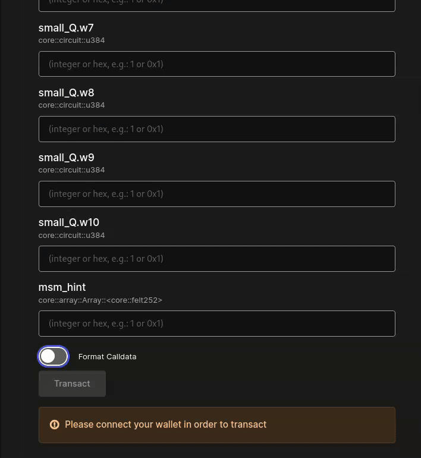

# Generating calldata from a proof and using your deployed contract



Easier workflow and typescript packages are under development to call your contract from the command line / do this in the browser.



Once your groth16 contract is deployed, you will need to call its main endpoint `verify_groth16_proof_bn254`, or `verify_groth16_proof_bls12_381`. \
\
The Groth16 proof needs pre-processing and extra computation to allow efficient verification. \
\
To serialize the calldata correctly, a helper is available in the file [`hydra/garaga/starknet/groth16_contract_generator/calldata.py`](https://github.com/keep-starknet-strange/garaga/blob/main/hydra/garaga/starknet/groth16\_contract\_generator/calldata.py)

Modify the end of file to specify the path of your verifying key and your groth16 proof with its associated public inputs. \


```python
if __name__ == "__main__":
    VK_PATH = "hydra/garaga/starknet/groth16_contract_generator/examples/snarkjs_vk_bn254.json"
    PROOF_PATH = "hydra/garaga/starknet/groth16_contract_generator/examples/snarkjs_proof_bn254.json"
    PUBLIC_INPUTS_PATH = "hydra/garaga/starknet/groth16_contract_generator/examples/snarkjs_public_bn254.json"

    vk = Groth16VerifyingKey.from_json(file_path=VK_PATH)
    proof = Groth16Proof.from_json(
        proof_path=PROOF_PATH, public_inputs_path=PUBLIC_INPUTS_PATH
    )

    calldata = groth16_calldata_from_vk_and_proof(vk, proof)

    print(calldata)
    print(len(calldata))
```


As for the verifying key, both Snarkjs and Gnark `proof.json` and `public.json` are supported out of the box. See the example in the previous page for Gnark export.

Alternatively, the `public_inputs_path` can be omitted if your proof include everything at once, as below.

<pre class="language-json" data-title="my_proof.json"><code class="lang-json">{
    "eliptic_curve_id": "bn254",
    "proof": {
        "a": {
            "x": "0x2abaae3dd6e4c662f5e071bca525a26d21e2400d01d02c87bce2e8363285990a",
            "y": "0x24211ff0aa742a6dd1651aadce6f72757beb89de2cff83a6162de7c15674c2"
        },
        "b": {
            "x": [
                "0x2335f1564c154d7a2ec5d11faf6d991a205bef2858f1687976d0a46502f5224a",
                "0x223af0bb0912d8ebc535ed489d06cd01fcf4a8ab4596cc28164edf9041d97080"
            ],
            "y": [
                "0x182e8fd86a44983de1d1d9dc4f12f134535b75d39f7aeb21adbf57e1a32ee603",
                "0xecb11668a0dd5d5031b0837e62ba14222b45718dc101c1278f44a9ed823c16b"
            ]
        },
        "c": {
            "x": "0x290243624a4c11868e7cb0c0f7cfd690dac08e4205d19795b0a8f686dddcdfd6",
            "y": "0x15de00cc8af159fbdbdc802592e83e1ac61a8026b97e8889b8c5def59ec50b16"
        }
    },
    "public_inputs": [
        "0x1e17db88c1d2e83e49f692cce4bb8169309de90afb2b141156243106aa34b474"
    ]
<strong>}
</strong></code></pre>

Then, simply run `python hydra/garaga/starknet/groth16_contract_generator/calldata.py`

You will notice that the calldata is quite big!\
\
Using [voyager](https://sepolia.voyager.online/), you can write to the `verify_groth16_proof` endpoint by directly pasting the array:&#x20;


<figure><figcaption></figcaption></figure>

Otherwise, use you favorite tool to call your contract.&#x20;
