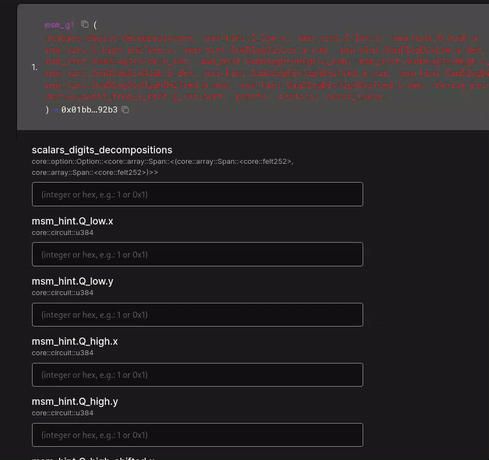

# EC (Multi)-Scalar Multiplication

For a given elliptic curve, scalar multiplication consists of adding a point `P` to itself `s` times, where `P` is a point satisfying the curve equation and `s` a scalar.\
\
`k.P = P+P+P+...+P (k times)`\
\
\
Multi scalar multiplication consists of the sum of `n` scalar multiplication with different points and scalars :

$$
\sum_{i=1}^{n} k_i \times P_i
$$

A single `msm_g1` function in Garaga computes the multi-scalar multiplication for a given set of points and scalars for a given elliptic curve. Since it also works with `n=1`, it is also able to compute a single scalar multiplication.

```toml
[package]
name = "my_package_that_needs_ec_scalar_mul"
version = "0.1.0"
edition = "2024_07"

[dependencies]
garaga = "1.0.1"

[cairo]
sierra-replace-ids = false
```


You can also add the dependency using `scarb add garaga`. See the [installation guide](README.md#installation) for more options.


The function will be importable using

```rust
use garaga::ec_ops::msm_g1;
use garaga::definitions::G1Point;
```

```rust
fn msm_g1(
    points: Span<G1Point>,
    scalars: Span<u256>,
    curve_index: usize,
    msm_hint: Span<felt252>,
) -> G1Point {
```

As you can see, this function not only needs points and scalars, but also additional information, to perform the computation much more efficiently.\
\
Under `hydra/garaga/starknet/tests_and_calldata_generators/`, you will find in the file [`msm.py`](https://github.com/keep-starknet-strange/garaga/blob/main/hydra/garaga/starknet/tests_and_calldata_generators/msm.py) some tools to generate a cairo test (using `MSMCalldataBuilder.to_cairo_1_test()`) for this function given some points and scalars, or directly the raw calldata for starknet usage (using `MSMCalldataBuilder.serialize_to_calldata()`).

### Generating and using calldata

\
An example contract is already [deployed](https://sepolia.voyager.online/contract/0x012686bdb4ca3f22ffc93dfe1e24d72294aac38a4f6b997b456fb4368fb3390b#readContract) on sepolia, solely holding an endpoint to this function.\
The source code to the contract is [here](https://github.com/keep-starknet-strange/garaga/blob/main/src/contracts/universal_ecip/src/lib.cairo) .\
\
You can try this deployed contract on any supported curves modifying the [`msm.py`](https://github.com/keep-starknet-strange/garaga/blob/main/hydra/garaga/starknet/tests_and_calldata_generators/msm.py) script at the end :

```python
if __name__ == "__main__":
    import random

    c = CurveID.SECP256K1
    order = CURVES[c.value].n
    msm = MSMCalldataBuilder(
        curve_id=c,
        points=[G1Point.gen_random_point(c) for _ in range(1)],
        scalars=[random.randint(0, order) for _ in range(1)],
    )
    cd = msm.serialize_to_calldata(
        include_points_and_scalars=True,
        serialize_as_pure_felt252_array=False,
    )
    print(cd)
    print(len(cd))
```

The options are :

* `include_points_and_scalars` : If set to `False`, the input points, scalars, and `curve_index` will not be part of the calldata.
* `serialize_as_pure_felt252_array` : If set to `True`, preprend the total length of the calldata at the beginning. \\

These options are only useful when you want to use points and scalars from another source than the calldata.\
\
For example, checkout the [groth16 verifier contracts](https://github.com/keep-starknet-strange/garaga/blob/main/src/contracts/autogenerated/groth16_example_bn254/src/groth16_verifier.cairo). It makes a delegated call to the endpoint `msm_g1` using the already declared contract's class hash, and pushes the (fixed) points from the hardcoded verifying key, and the scalars from the groth16 proof:

```rust
impl IGroth16VerifierBN254 of super::IGroth16VerifierBN254<ContractState> {
    fn verify_groth16_proof_bn254(
        self: @ContractState, full_proof_with_hints: Span<felt252>,
    ) -> Result<Span<u256>, felt252> {
        let fph = deserialize_full_proof_with_hints_bn254(full_proof_with_hints);
        let groth16_proof = fph.groth16_proof;
        let mpcheck_hint = fph.mpcheck_hint;
        let msm_hint = fph.msm_hint;

        groth16_proof.raw.check_proof_points(0);

        let ic = ic.span();

        let vk_x: G1Point = match ic.len() {
            0 => panic!("Malformed VK"),
            1 => *ic.at(0),
            _ => {
                // Build calldata in the expected order: points/public inputs/curve id, then hint.
                let mut msm_calldata: Array<felt252> = array![];
                Serde::serialize(@ic.slice(1, N_PUBLIC_INPUTS), ref msm_calldata);
                Serde::serialize(@groth16_proof.public_inputs, ref msm_calldata);
                // Curve identifier (0 for BN254)
                msm_calldata.append(0);
                // Append the MSM hint elements
                for x in msm_hint { msm_calldata.append(*x); }

                // Delegated call to Garaga ECIP ops contract to compute vk_x
                let mut _vx_x_serialized = starknet::syscalls::library_call_syscall(
                    ECIP_OPS_CLASS_HASH.try_into().unwrap(),
                    selector!("msm_g1"),
                    msm_calldata.span(),
                ).unwrap_syscall();

                ec_safe_add(
                    Serde::<G1Point>::deserialize(ref _vx_x_serialized).unwrap(), *ic.at(0), 0,
                )
            }
        };
        // ...
    }
}
```

Here, calldata is constructed by first serializing the points from the verifying key (excluding `ic[0]`) and the Groth16 public inputs, then appending the curve identifier (0 for BN254), and finally appending the MSM hint elements. The contract now accepts a single `full_proof_with_hints` blob and returns `Result<Span<u256>, felt252>`.
\
In our example below, you can still generate inputs with the Python helper, but the verifier assembles calldata explicitly in this order before delegating to `msm_g1`.
\
In our example, we'll leave the default parameters that will include everything for a direct endpoint call.\
Simply run :

```
python hydra/garaga/starknet/tests_and_calldata_generators/msm.py
```

And copy paste the array in voyager to see!

<figure><figcaption></figcaption></figure>
